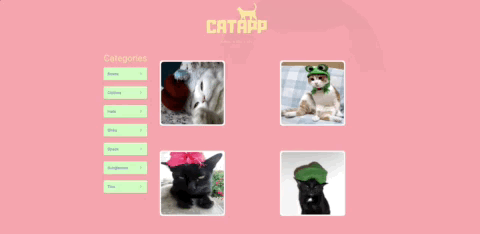

## :camera: Demonstração




### :books: Tecnologias usadas

✅ React


✅ Styled-components


✅ Axios


✅ Redux


✅ Eslint


✅ Prettier


### :rocket: Projeto

**CatApp** é uma aplicação feita em **ReactJS e Redux**, que usa a API [thecatapi](https://docs.thecatapi.com/api-reference/images/images-search), para listar a imagem/categorias dos gatos


### :mortar_board: Instruções

**Clonar** o repositorio

```bash

git clone https://github.com/LdFerreira/CatApp.git

```


<br>


Para iniciar **FrontEnd** - Abra o pasta **FrontEnd** no seu terminal e  **execute** os seguintes comandos:
>Necessario [yarn](https://yarnpkg.com/) para os comandos abaixo
```bash
yarn
```
>Para instalar as dependencias
```bash
yarn start
```
>Para iniciar o servidor

>Servidor iniciara em localhost:3000


<br>


---

### :computer: Development

Developed by **Leandro Siqueira Ferreira**
